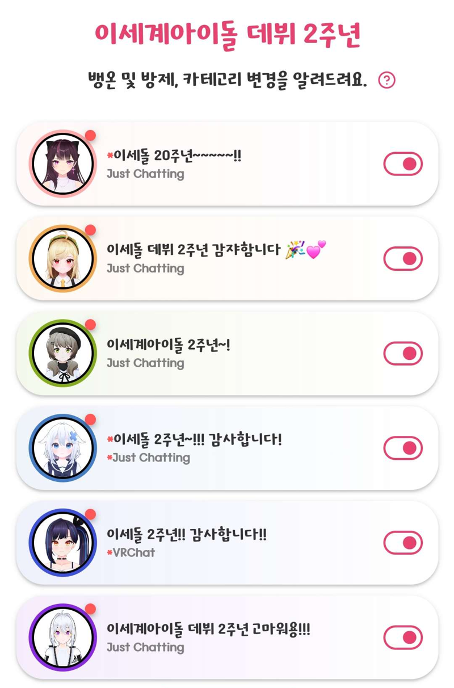
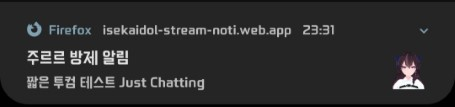

# Isekaidol Stream Noti

[이세계 아이돌(이세돌)](https://namu.wiki/w/%EC%9D%B4%EC%84%B8%EA%B3%84%20%EC%95%84%EC%9D%B4%EB%8F%8C) 트위치 뱅온 및 방제, 카테고리 변경 알림 서비스.  
[https://isekaidol-stream-noti.web.app/](https://isekaidol-stream-noti.web.app/)

## 기능

- 이세계 아이돌 멤버들의 트위치 채널을 모니터링하여 아래 경우에 알림.  
  (웹 페이지를 열어두지 않아도 됨.)
  - 방송이 켜짐.
  - 채널의 제목이 변경됨.
  - 채널의 카테고리(게임)가 변경됨.
- 웹 페이지에서 채널별 알림 구독 여부 설정 및 최근 정보 확인.

PC:  
  
Mobile:  

## 사용 방법

1. PC나 모바일에서 모-던 웹 브라우저로 [사이트](https://isekaidol-stream-noti.web.app/) 접속.  
  (애플 지원 안함.)
1. 알림을 받을 멤버 카드 우측의 스위치를 켠다.
1. 알림 권한을 허용할거냐는 팝업이 뜨면 허용한다.  
1. 로딩이 사라지면 사이트를 닫아둬도 된다.  
  (PC에선 브라우저 실행은 필요하며 모바일은 상관 없음.)

## 텔레그램 채널

웹 알림 외에도 멤버별 텔레그램 채널(대화 불가)에서도 알림.

- [@jururu_stream_noti](https://t.me/jururu_stream_noti)
- [@jingburger_stream_noti](https://t.me/jingburger_stream_noti)
- [@viichan_stream_noti](https://t.me/viichan_stream_noti)
- [@gosegu_stream_noti](https://t.me/gosegu_stream_noti)
- [@lilpa_stream_noti](https://t.me/lilpa_stream_noti)
- [@ine_stream_noti](https://t.me/ine_stream_noti)

## 구조

## 사용한 것들

- Svelte + Typescript.
- Firebase Hosting, Realtime Database, Cloud Functions, Messaging.
- Twitch, Telegram API.
