# Isekaidol Stream Noti

🚧 공사중(될지 안될지 몰?루) 🚧

[이세계 아이돌(이세돌)](https://namu.wiki/w/%EC%9D%B4%EC%84%B8%EA%B3%84%20%EC%95%84%EC%9D%B4%EB%8F%8C) 트위치 뱅온 및 방제, 카테고리 변경 알림 서비스.  
[https://isekaidol-stream-noti.web.app/](https://isekaidol-stream-noti.web.app/)

## 기능

- 이세계 아이돌 멤버들의 트위치 채널을 모니터링(1분 간격)하여 아래 경우 알림.  
  (웹 페이지를 열어두지 않아도 됨.)
  - 방송이 켜짐.
  - 채널의 제목이 변경됨.
  - 채널의 카테고리(게임)가 변경됨.
- 웹 페이지에서 채널별 알림 구독 여부 설정 및 최근 정보 확인.

## 구조

```mermaid
flowchart BT
    U(User) -- 구독 설정 --> P(Web Page)
    P -- 방송 정보, 알림 표시 --> U
    
    P <-- 설정 저장/불러오기 --> S(Local Storage)
    
    P -- 구독 설정 전송 --> DB(Realtime Database)
    DB -- 방송 정보 전송 --> P

    DB -- 구독 변경 트리거 --> FN(Cloud Functions)
    FN -- 방송 정보 갱신 --> DB

    FN -- 구독 설정, 알림 요청 --> M(Messaging)
    TW(Twitch) -- 방송 정보 제공 --> FN

    M -- 푸시 알림 --> P
```

## 사용한 것들

- Svelte + Typescript.
- Firebase Hosting, Realtime Database, Cloud Functions, Messaging.
- Twitch API.
